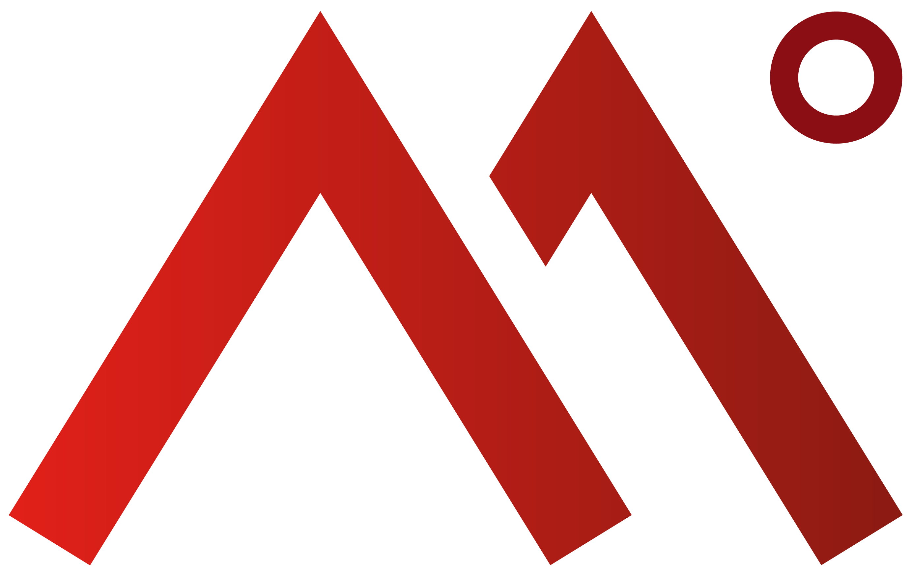

# LogoSoup



[](CHANGELOG.md)
[](LICENSE)
[](https://github.com/Codeminer42/ruby-logo-soup/actions/workflows/coverage-main.yml)

**Make a row of mismatched logos look like they belong together.**

LogoSoup is a framework-agnostic Ruby gem that turns any logo — SVG, PNG, JPG,
WebP, GIF, or TIFF — into an inline CSS string sized so the logo *looks* the
same visual weight as its neighbors, regardless of its intrinsic dimensions,
padding, or how dense the artwork is.

```ruby
LogoSoup.style(svg: File.read("logo.svg"), base_size: 48)
# => "width: 48px; height: 48px; object-fit: contain; display: block; transform: translate(0px, -1.2px);"
```

LogoSoup handles:

- **Aspect-ratio normalization** — a 200×100 logo and a 100×200 logo end up with comparable on-screen area, not the same bounding box.
- **Density-aware sizing** — sparse outline logos grow slightly; dense filled logos shrink slightly, so neither dominates.
- **Visual-center alignment** — computes a `translate()` so the logo's perceived center sits where its geometric box says it should, fixing top-heavy or bottom-heavy artwork.
- **Mixed input formats** — SVG strings, file paths, or in-memory bytes with a content type.
- **Graceful degradation** — when libvips can't decode the input, returns a sane fallback style instead of raising.

This gem is a Ruby port of the original
[Logo Soup](https://github.com/auroris/logo-soup) React library, inspired by the
article
[The logo soup problem (and how to solve it)](https://www.sanity.io/blog/the-logo-soup-problem)
by Rostislav Melkumyan.

## Security — trusted inputs only

> [!WARNING]
> **LogoSoup is designed for logo assets you control.** Do **not** feed it
> images uploaded by end users, fetched from arbitrary URLs, or anything else
> originating from an untrusted source.

LogoSoup invokes `libvips` and `Nokogiri` directly on the inputs you pass.
Neither call site enforces a maximum input size, maximum decoded pixel count,
strict MIME-type validation, or path-traversal protection — by design, so the
gem stays a thin, predictable wrapper over the underlying libraries.

Concrete consequences of using LogoSoup on untrusted input:

- **Decompression bombs.** A small malicious PNG, TIFF, or WebP can decode to
  multiple gigabytes. `Vips::Image.new_from_buffer` / `new_from_file` will
  decode the header (and depending on format, large portions of the body)
  before LogoSoup has a chance to downsample.
- **SVG payloads.** SVG is XML. While the parser blocks network entity
  resolution (`Nokogiri::XML(...) { |cfg| cfg.nonet }`), an attacker can still
  ship arbitrarily large SVG strings or deeply nested structures that consume
  CPU and memory.
- **Path handling.** `image_path:` is passed directly to libvips. If the
  caller supplies a path derived from user input, traversal and arbitrary file
  read by libvips become the caller's problem.

**Recommended usage:**

- Bundle logo SVGs and rasters as static assets in your repository, or pull
  them from a trusted internal source (a CMS you operate, a logo vendor API
  with allowlisted hosts, etc.).
- If you absolutely must accept user-supplied images, validate file size,
  MIME type, and decoded pixel dimensions **before** calling LogoSoup, and run
  the call inside an isolated process with a memory and CPU limit.

For brand directories, marketing pages, partner showcases, design systems,
and "logo cloud" layouts populated from your own asset pipeline, LogoSoup is
exactly the right tool. For user-generated content, it is not.

## Contents

- [Security — trusted inputs only](#security--trusted-inputs-only)
- [Why](#why)
- [Installation](#installation)
- [Requirements](#requirements)
- [Quick start](#quick-start)
- [Inputs](#inputs)
  - [SVG string](#svg-string)
  - [Raster file path](#raster-file-path)
  - [Raster bytes (IO or String)](#raster-bytes-io-or-string)
- [Options reference](#options-reference)
  - [`base_size`](#base_size)
  - [`scale_factor`](#scale_factor)
  - [`density_aware` / `density_factor`](#density_aware--density_factor)
  - [`align_by`](#align_by)
  - [`contrast_threshold`](#contrast_threshold)
  - [`pixel_budget`](#pixel_budget)
  - [`on_error`](#on_error)
- [Output](#output)
- [Recipes](#recipes)
  - [Plain ERB / HTML](#plain-erb--html)
  - [Rails view helper](#rails-view-helper)
  - [Phlex / ViewComponent](#phlex--viewcomponent)
  - [Caching the style](#caching-the-style)
- [How it works](#how-it-works)
  - [SVG pipeline](#svg-pipeline)
  - [Raster pipeline](#raster-pipeline)
  - [Sizing math](#sizing-math)
  - [Visual-center math](#visual-center-math)
- [Performance](#performance)
- [Error handling](#error-handling)
- [Testing](#testing)
- [Development](#development)
- [Contributing](#contributing)
- [Changelog](#changelog)
- [License](#license)

## Why

Logos arrive with wildly different intrinsic dimensions, padding, transparency,
and visual weight. If you drop them into a `` grid,
the result feels uneven: the airy circular logo looks tiny, the chunky
wordmark feels oversized, and a tall logo collides with the row above.

LogoSoup tackles this with three complementary normalizations:

1. **Sizing** — interpolate between "same width" and "same height" based on a
   `scale_factor`, so the *area* a logo occupies stays roughly constant across
   different aspect ratios.
2. **Density-aware correction** — analyze how much of the image is actual
   artwork (versus background) and gently shrink dense logos or grow sparse
   ones to equalize perceived weight.
3. **Visual centering** — compute the artwork's center of mass and emit a CSS
   `transform: translate(...)` so off-center artwork aligns visually rather
   than by its bounding box.

The output is a plain CSS string, so you can drop it into any framework — ERB,
Phlex, ViewComponent, Hanami, Roda, Sinatra, raw Rack — without pulling in
template helpers.

## Installation

Add this line to your application's Gemfile:

```ruby
gem "logosoup"
```

Then:

```sh
bundle install
```

Or, with Bundler:

```sh
bundle add logosoup
```

## Requirements

- **Ruby** `>= 3.1`, `< 4.0`
- **libvips** for raster analysis
- **librsvg** if you want raster feature measurement on SVG inputs (i.e. when
  `align_by: "visual-center*"` is used with SVG; viewBox-only sizing does not
  need it)

### Installing system dependencies

**macOS (Homebrew):**

```sh
brew install vips librsvg
```

**Ubuntu / Debian:**

```sh
sudo apt-get update
sudo apt-get install -y libvips42 librsvg2-2
```

**Alpine:**

```sh
apk add vips librsvg
```

**Docker:** see [Development → Docker](#docker) — the bundled `Dockerfile`
already includes everything.

## Quick start

```ruby
require "logosoup"

# SVG string
LogoSoup.style(svg: File.read("logo.svg"), base_size: 48)

# Raster file
LogoSoup.style(image_path: "logo.png", base_size: 48)

# Raster bytes (e.g. from an HTTP response or an upload)
LogoSoup.style(
  image_bytes: response.body,
  content_type: "image/webp",
  base_size: 48
)
```

The return value is an inline CSS string ready to drop into a `style=""`
attribute:

```erb
" style="<%= LogoSoup.style(svg: logo.svg, base_size: 48) %>">
```

## Inputs

LogoSoup accepts exactly one of `svg:`, `image_path:`, or `image_bytes:` per
call. If none are given, you get the [fallback style](#error-handling).

### SVG string

```ruby
LogoSoup.style(
  svg: '<svg viewBox="0 0 200 100" xmlns="http://www.w3.org/2000/svg">...</svg>',
  base_size: 48
)
```

Intrinsic dimensions come from `viewBox`, then `width`/`height` attributes
(stripped of unit suffixes like `px`, `pt`, etc.). When the document has no
parseable dimensions, LogoSoup returns a square fallback at `base_size`.

When `align_by:` is a visual-center mode, the SVG is also rasterized by
libvips (via librsvg) so pixel-based features can be measured. With
`align_by: "bounds"` (or any non-visual-center mode), no rasterization
happens — only the XML is parsed.

### Raster file path

```ruby
LogoSoup.style(image_path: "/var/uploads/logo.png", base_size: 48)
```

Any format libvips can decode is supported: PNG, JPG/JPEG, WebP, GIF, TIFF,
HEIC, AVIF, ICO, BMP, and more depending on your libvips build.

### Raster bytes (IO or String)

```ruby
LogoSoup.style(
  image_bytes: File.binread("logo.webp"),
  content_type: "image/webp",
  base_size: 48
)
```

`image_bytes:` accepts a binary `String` or any IO that responds to `#read`.
If `content_type` contains the substring `svg` (e.g. `image/svg+xml`), the
bytes are routed through the SVG pipeline instead. Otherwise the bytes are
handed directly to libvips's buffer loader — no temp file is created.

## Options reference

All options below can be passed to `LogoSoup.style`. Defaults live in
[`LogoSoup::Style::DEFAULTS`](lib/logosoup/style.rb).

### `base_size`

**Required.** Target rendering size in pixels (Integer or Numeric).

This is both the normalization target *and* the fallback size — when LogoSoup
can't read the input, you get `width: base_size; height: base_size;`.

```ruby
LogoSoup.style(svg: svg, base_size: 32)   # small badge
LogoSoup.style(svg: svg, base_size: 64)   # default-ish
LogoSoup.style(svg: svg, base_size: 128)  # hero
```

### `scale_factor`

**Default:** `0.5` — Float in `[0.0, 1.0]`.

Interpolates between "same width" and "same height" for logos of different
aspect ratios:

| `scale_factor` | Effect | Description |
| --- | --- | --- |
| `0.0` | Same width | Every logo gets `width = base_size`; height varies. |
| `0.5` | Same area *(default)* | Width and height scale with `√aspect` so the on-screen area stays roughly constant. |
| `1.0` | Same height | Every logo gets `height = base_size`; width varies. |

For a wall of logos, `0.5` gives the most uniform visual impression. For a
strict grid where horizontal alignment matters more than area, use `0.0`. For
a row where vertical rhythm matters, use `1.0`.

```ruby
LogoSoup.style(svg: svg, base_size: 48, scale_factor: 0.0)  # width-locked
LogoSoup.style(svg: svg, base_size: 48, scale_factor: 0.5)  # area-locked
LogoSoup.style(svg: svg, base_size: 48, scale_factor: 1.0)  # height-locked
```

### `density_aware` / `density_factor`

**Defaults:** `density_aware: true`, `density_factor: 0.5`.

When enabled, LogoSoup measures how much of the image is real artwork (as
opposed to background or transparent pixels) and applies a multiplicative
scale that's clamped to **`[0.5, 2.0]`** to avoid extreme corrections.

- Dense logos (lots of filled pixels) → shrunk slightly so they don't
  dominate.
- Sparse logos (outline icons, lots of whitespace) → grown slightly so they
  read at comparable weight.

The strength of the correction is controlled by `density_factor`:

- `0.0` — no correction (equivalent to `density_aware: false`).
- `0.5` — half-strength (default; gentle nudge).
- `1.0` — full-strength.

```ruby
# Disable density correction entirely:
LogoSoup.style(svg: svg, base_size: 48, density_aware: false)

# Or via factor:
LogoSoup.style(svg: svg, base_size: 48, density_factor: 0.0)

# Stronger correction (good when the input mix is wildly inconsistent):
LogoSoup.style(svg: svg, base_size: 48, density_factor: 1.0)
```

The reference density is calibrated so a "typical" logo (~35 % artwork
coverage at full opacity) gets no correction.

### `align_by`

**Default:** `"visual-center-y"`.

Controls whether and how LogoSoup emits a `transform: translate(...)` to
correct artwork that's off-center within its bounding box.

| Value | Effect |
| --- | --- |
| `"visual-center-y"` *(default)* | Translate vertically only. Fixes top-heavy / bottom-heavy logos in a horizontal row. |
| `"visual-center-x"` | Translate horizontally only. Useful when logos are stacked vertically. |
| `"visual-center"` | Translate on both axes. |
| `"bounds"` | No transform. Logos are aligned by their bounding box. |
| `""` (empty), `nil` | Same as `"bounds"` — no transform. |

The translate is computed from a **weighted center of mass** of the artwork
(see [Visual-center math](#visual-center-math)) and scaled to the final
rendered size. If the artwork is already centered (the offset rounds to zero),
no `transform:` is emitted at all.

```ruby
LogoSoup.style(svg: svg, base_size: 48, align_by: "visual-center-y")  # default
LogoSoup.style(svg: svg, base_size: 48, align_by: "visual-center")    # both axes
LogoSoup.style(svg: svg, base_size: 48, align_by: "bounds")           # no transform
```

### `contrast_threshold`

**Default:** `10` — Integer in `[0, 255]`.

When detecting the artwork's content box and visual center, pixels are
classified as "background" or "artwork" by comparing them to the detected
background color. `contrast_threshold` is the per-channel distance below which
a pixel counts as background.

- Lower (e.g. `5`) — more sensitive; counts faint anti-aliased edges as
  artwork. Use for logos with subtle gradients.
- Higher (e.g. `30`) — more tolerant; ignores noisy borders, JPEG halos, or
  near-white backgrounds. Use for logos rasterized poorly.

For images with an alpha channel, alpha is used directly and this threshold
applies to the alpha cutoff instead of RGB distance.

```ruby
LogoSoup.style(image_path: "noisy.jpg", base_size: 48, contrast_threshold: 30)
```

### `pixel_budget`

**Default:** `2048` — Integer (max pixels sampled per raster analysis).

Raster analysis is performed on a downsampled copy of the input. The downsample
target is whichever resize keeps the total pixel count at or below
`pixel_budget`. Higher budgets give marginally more accurate density and
center-of-mass estimates, at proportional CPU and memory cost.

For most logo-grid use cases, the default 2048 (≈ 45×45) is plenty.

```ruby
LogoSoup.style(image_path: "hero.png", base_size: 256, pixel_budget: 8192)
```

### `on_error`

**Default:** `nil` — `nil` or `:raise`.

- `nil` *(default)* — any exception during analysis is swallowed and a
  fallback style is returned (`width: base_size; height: base_size; ...` with
  no transform). Suitable for user-facing rendering paths where a broken logo
  shouldn't break the page.
- `:raise` — re-raise the original exception. Suitable for ingestion
  pipelines, tests, or anywhere you'd rather see the failure.

```ruby
# Default: never raises, returns a usable style even for garbage input.
LogoSoup.style(svg: "<not really an svg>", base_size: 48)
# => "width: 48px; height: 48px; object-fit: contain; display: block;"

# Strict mode:
LogoSoup.style(svg: "<not really an svg>", base_size: 48, on_error: :raise)
# raises whatever Nokogiri / libvips threw
```

## Output

The return value is always a single inline CSS string of the form:

```
width: ...px; height: ...px; object-fit: contain; display: block; transform: translate(...);
```

The `transform:` property is omitted when the computed offset is zero or when
`align_by` disables it. `object-fit: contain` and `display: block` are always
emitted, so the same string works on ``, `<svg>`, `<video>`, and most
other replaced elements.

Numeric values in `translate()` are rounded to one decimal place. Integer
results are emitted without a trailing `.0`.

## Recipes

### Plain ERB / HTML

```erb
"
     alt="<%= logo.name %>"
     style="<%= LogoSoup.style(image_path: logo.path, base_size: 48) %>">
```

### Rails view helper

```ruby
# app/helpers/logo_helper.rb
module LogoHelper
  def normalized_logo_tag(logo, size: 48, **options)
    style = LogoSoup.style(
      svg: logo.svg_content,
      base_size: size,
      **options
    )
    image_tag(logo.url, alt: logo.name, style: style)
  end
end
```

```erb
<%= normalized_logo_tag(@logo, size: 64, align_by: "visual-center") %>
```

### Phlex / ViewComponent

```ruby
class LogoComponent < Phlex::HTML
  def initialize(logo, size: 48)
    @logo = logo
    @style = LogoSoup.style(svg: logo.svg, base_size: size)
  end

  def view_template
    img(src: @logo.url, alt: @logo.name, style: @style)
  end
end
```

### Caching the style

LogoSoup recomputes from scratch on every call. For high-traffic pages, cache
the result keyed by `(logo_id, base_size, options)`:

```ruby
Rails.cache.fetch(["logosoup", logo.cache_key, base_size, options], expires_in: 1.week) do
  LogoSoup.style(svg: logo.svg, base_size: base_size, **options)
end
```

Since the output is a small string, the cache footprint is negligible compared
to the cost of rasterizing the logo each time.

## How it works

### SVG pipeline

1. **Parse the XML** with Nokogiri to extract intrinsic dimensions from
   `viewBox` (preferred) or `width`/`height`.
2. **If a visual-center mode is requested**, rasterize the SVG via libvips
   (`new_from_buffer`, no temp file) and run it through the raster pipeline to
   estimate density, content box, and center-of-mass.
3. **Scale the raster-derived features** back into the SVG's intrinsic
   coordinate space, so the transform reads in the user's logical pixels.

### Raster pipeline

1. **Decode** with libvips (from path or in-memory buffer).
2. **Downsample** so total pixels ≤ `pixel_budget`, then normalize to 4-band
   RGBA uchar.
3. **Detect background.** Sample perimeter pixels and bucket them into a
   coarse RGB histogram (3-bit-per-channel quantization, 512 buckets total).
   If more than 10 % of the perimeter is transparent (alpha < 128), treat the
   image as having an alpha-only background. Otherwise pick the most-populous
   color bucket as the background RGB.
4. **Measure features.** Iterate every sampled pixel:
   - For alpha-only images, weight by `alpha²`.
   - Otherwise, treat each pixel's RGB distance from the background (and
     `contrast_threshold` floor) as its weight.
   - Accumulate weighted center of mass, content bounding box, and average
     opacity. From these derive **pixel density** = coverage × average
     opacity.
5. **Return** density, content box, and visual-center offsets in source
   coordinates.

### Sizing math

For intrinsic dimensions `(w, h)` and target `base`:

```
aspect           = w / h
normalized_width = aspect^scale_factor * base
normalized_height = normalized_width / aspect
```

When density-aware:

```
density_ratio = measured_density / 0.35     # 0.35 is the reference density
density_scale = (1 / density_ratio) ^ (density_factor * 0.5)
density_scale = density_scale.clamp(0.5, 2.0)
normalized_width  *= density_scale
normalized_height *= density_scale
```

Both dimensions are finally rounded to whole pixels.

### Visual-center math

The visual-center pipeline returns a `(offset_x, offset_y)` pair in the source
image's coordinate space — the vector pointing from the content box's
*geometric* center to its *weighted* center of mass. To produce a CSS
transform, LogoSoup scales the offset to the rendered size:

```
scale_x = normalized_width  / content_box_width
scale_y = normalized_height / content_box_height
translate(-offset_x * scale_x px, -offset_y * scale_y px)
```

Concretely: a logo with ink biased toward the top of its bounding box
produces a positive `Y` translate, which slides the rendered image *down* so
its ink sits at the bounding box's geometric center — i.e. where a viewer
expects the visual center to be. Ink biased downward produces a negative
`Y` translate. For axis-restricted modes (`"visual-center-x"` /
`"visual-center-y"`), the other axis is zeroed before the translate is
emitted.

## Performance

A typical `LogoSoup.style` call costs:

- **SVG (no visual-center)**: one Nokogiri XML parse. Microseconds.
- **SVG (with visual-center)**: one libvips SVG decode + one rasterization +
  one pixel-budget sweep. Sub-millisecond to low single-digit milliseconds.
- **Raster path/bytes**: one libvips decode + downsample + pixel-budget sweep.
  Similar to the SVG case.

Knobs you have:

- Lower `pixel_budget` for cheaper analysis. The default 2048 is tuned for
  accuracy; halving it roughly halves the pixel-sweep cost (libvips decode
  and overhead aside) and produces nearly identical results for typical
  logos. Measure before tuning.
- Set `align_by: "bounds"` to skip raster feature measurement entirely on the
  SVG path — useful when you only need normalized sizing.
- [Cache the output](#caching-the-style) for hot paths.

Memory-wise, LogoSoup keeps the downsampled pixel buffer as a binary `String`
(no intermediate `Array<Integer>` materialization) and reads pixels via
`String#getbyte`, so per-call memory is bounded by `pixel_budget * 4 bytes`
plus libvips internals.

## Error handling

By default, every failure inside `LogoSoup.style` produces a fallback style
instead of raising:

```ruby
LogoSoup.style(svg: nil, base_size: 48)
# => "width: 48px; height: 48px; object-fit: contain; display: block;"

LogoSoup.style(image_path: "/does/not/exist.png", base_size: 48)
# => "width: 48px; height: 48px; object-fit: contain; display: block;"

LogoSoup.style(svg: '<svg viewBox="bad data">', base_size: 48)
# => "width: 48px; height: 48px; object-fit: contain; display: block;"
```

For strict environments (background jobs, validators, tests), opt into the
raising mode:

```ruby
LogoSoup.style(image_path: "/does/not/exist.png", base_size: 48, on_error: :raise)
# raises Vips::Error
```

The fallback is intentionally minimal — it never includes a `transform:` —
so the page renders the logo at its requested size even when LogoSoup's
analysis can't run.

## Testing

Run the full check suite (specs + RuboCop + Brakeman):

```sh
bundle exec rake
```

Or just RSpec:

```sh
bundle exec rake spec
# or
bundle exec rspec
```

### Coverage

Generate a local coverage report:

```sh
bundle exec rake spec:coverage
```

This writes HTML reports to `coverage/index.html` and an LCOV file at
`coverage/lcov.info`.

The coverage badge at the top of this README is generated automatically by the
[`Coverage Main`](.github/workflows/coverage-main.yml) GitHub Actions workflow
on every push to `main`. The workflow runs the suite with SimpleCov enabled,
extracts the line-coverage percentage from `coverage/.last_run.json`, and
publishes a shields.io endpoint JSON to an orphan `badges` branch. The README
badge URL points to that file via `shields.io/endpoint`, so it always reflects
the latest measurement without any external service signup.

## Development

### Local

```sh
bundle install
bundle exec rake spec
```

You'll need libvips and (for the SVG specs) librsvg installed locally —
see [Requirements](#requirements).

### Docker

A `Dockerfile` is provided so you can develop and run the test suite without
installing Ruby or libvips locally. The image bundles Ruby 3.3, libvips, and
librsvg.

Build the image once:

```sh
docker build -t logosoup-dev .
```

Run the test suite:

```sh
docker run --rm -v "$PWD":/app logosoup-dev bundle exec rspec
```

Run all default checks (specs + RuboCop + Brakeman):

```sh
docker run --rm -v "$PWD":/app logosoup-dev bundle exec rake
```

Open an interactive shell (irb, individual specs, ad-hoc commands):

```sh
docker run --rm -it -v "$PWD":/app logosoup-dev
```

Gems are baked into the image at build time, so a fresh `docker run` doesn't
need to `bundle install`. Rebuild the image (`docker build -t logosoup-dev .`)
whenever `Gemfile` or `Gemfile.lock` changes.

### Project layout

```
lib/logosoup.rb               # public entry point: LogoSoup.style
lib/logosoup/style.rb         # input dispatch + option plumbing
lib/logosoup/core/
  css.rb                      # tiny CSS string formatter
  svg_dimensions.rb           # viewBox / width / height parsing
  dimension_calculator.rb     # aspect + density sizing math
  visual_center_transform.rb  # translate(...) emission
  image_loader.rb             # vips decode + downsample + RGBA normalize
  background_detector.rb      # perimeter histogram → bg color / alpha mode
  pixel_analyzer.rb           # weighted center of mass + content box
  feature_measurer.rb         # orchestrates the raster pipeline
spec/                         # RSpec tests
script/coverage_diff.rb       # CI helper: PR vs main coverage delta
```

## Contributing

Bug reports and pull requests are welcome on GitHub at
<https://github.com/Codeminer42/ruby-logo-soup>.

- Keep changes focused. One concern per PR.
- Add or update specs for behavior changes.
- Update `CHANGELOG.md` for user-visible changes.
- Run `bundle exec rake` before opening a PR — RuboCop and Brakeman are part
  of CI.

## Changelog

See [`CHANGELOG.md`](CHANGELOG.md).

## License

Released under the MIT License. See [`LICENSE`](LICENSE).
